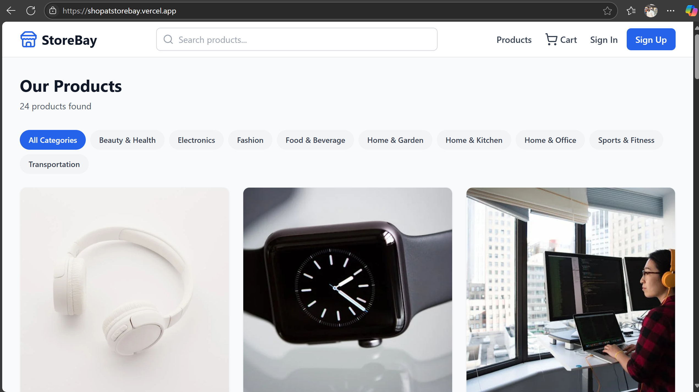

# 🛍️ StoreBay – Everything You Need, All in One Bay

**StoreBay** is a clean and modern e-commerce web application built with **React**, **TypeScript**, **Tailwind CSS**, and **Vite**. It provides a fast, scalable, and responsive shopping experience with a beautiful UI and smooth user flow.

## 🚀 Features

- 🛒 Browse and purchase products
- 🔍 Detailed product views with dynamic routing
- 🧾 Simple and intuitive checkout process
- 🎨 Custom styling using Tailwind CSS
- ⚡ Super-fast development environment with Vite
- ✨ Type-safe code with TypeScript

📦 Installation:<br>
 1. Clone the repository:
   ```bash
   git clone https://github.com/your-username/storebay.git
   cd storebay/project
```
2.Install dependencies:
```bash
npm install
```
## 🖼️ Project Preview




📄 License <br>
This project is licensed under the [MIT License](LICENSE).

 🙋‍♂️ Contact <br>
Developed by [ValiShaik](https://github.com/ValiShaik03) – feel free to reach out!

Email: mvali060103@gmail.com  
GitHub: [github.com/ValiShaik03](https://github.com/ValiShaik03)

 
